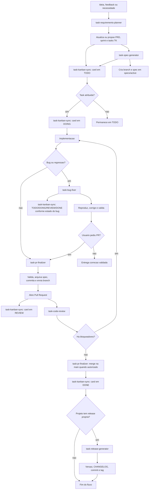

# Fluxos entre skills operacionais

Este documento resume os fluxos esperados entre as skills locais deste projeto pratico. Ele serve como mapa rapido para decidir qual skill acionar em cada momento do desenvolvimento.

## Regra de autorizacao

Skills podem sugerir movimentacao de Kanban, criacao de card, push, PR, merge ou tag, mas qualquer alteracao remota compartilhada exige pedido claro do usuario ou confirmacao explicita no momento do fluxo.

## Estados do Kanban

| Estado | Quando usar |
| ------ | ----------- |
| `TODO` | Requisito/task/bug registrado, ainda sem execucao ativa. |
| `DOING` | Task atribuida ou bug em investigacao/correcao. |
| `REVIEW` | PR aberto ou correcao aguardando revisao. |
| `DONE` | PR mergeado e validado, ou correcao aceita no fluxo do projeto. |
