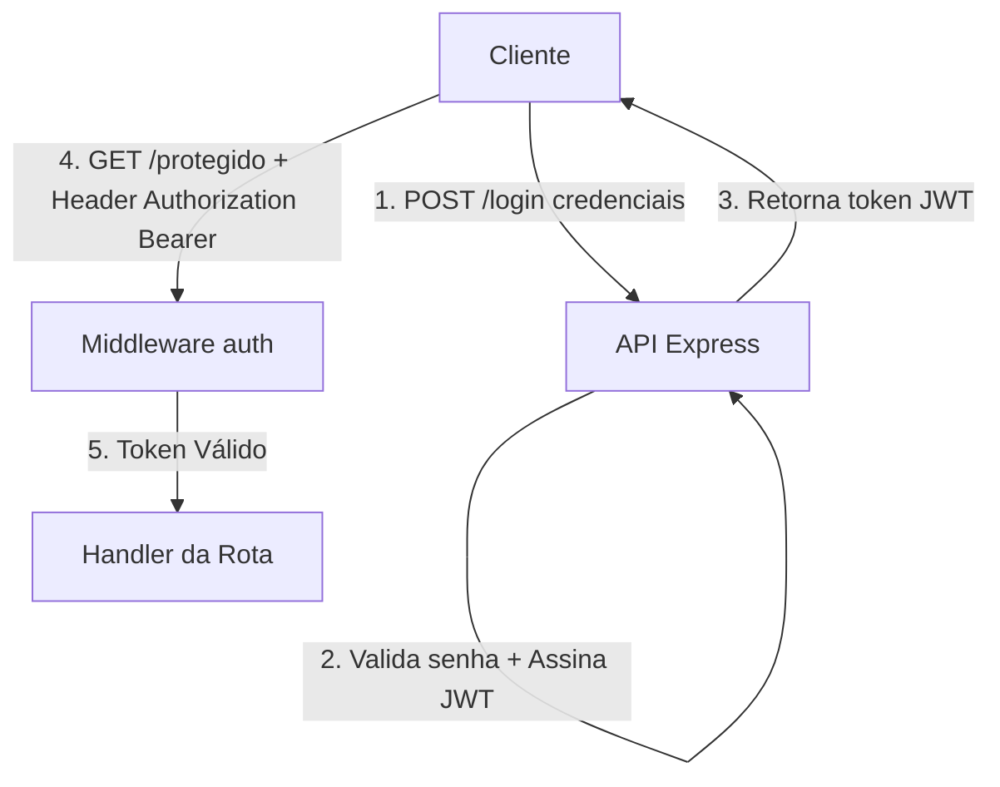

<!-- _class: lead -->

# Autenticação & JWT no Express

Construção de rotas protegidas e autenticação baseada em tokens.

---

## Fluxo da Autenticação JWT



---

## Middleware de Proteção de Rota

```typescript
import { Request, Response, NextFunction } from 'express';
import { verifyJwt } from '../lib/auth.ts';

export function authMiddleware(req: Request, res: Response, next: NextFunction) {
  const authHeader = req.headers.authorization;
  if (!authHeader?.startsWith('Bearer ')) {
    return res.status(401).json({ error: 'Token de acesso não fornecido.' });
  }

  const token = authHeader.split(' ')[1];
  const payload = verifyJwt(token);
  if (!payload) {
    return res.status(401).json({ error: 'Token inválido ou expirado.' });
  }

  req.user = payload;
  next();
}
```

---

## Segurança e Recomendações

- Nunca armazene senhas em texto puro; utilize hash com sal (ex: Argon2id ou HMAC-SHA256).
- Defina expiração curta para tokens de acesso.
- Transmite o token exclusivamente pelo cabeçalho `Authorization: Bearer <token>`.
