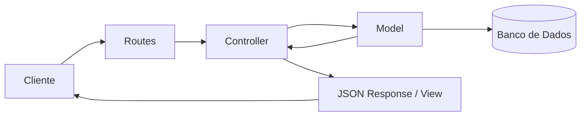

<!-- _class: lead -->

# Arquitetura MVC com Express

Separação clara de responsabilidades em camadas no desenvolvimento Web Back-end.

---

## As Três Camadas do MVC

- **Model**: Gerencia dados, esquemas e regras de persistência.
- **View (ou JSON Response)**: Apresentação ou resposta formatada ao cliente.
- **Controller**: Intercepta a requisição, coordena os Models e escolhe a resposta.

---

## Fluxo da Requisição no MVC

---

## Responsabilidades dos Controllers

- Controllers **não** acessam bancos de dados diretamente.
- Controllers **não** contêm lógicas complexas de validação ou cálculo.
- Controllers recebem `req`, acionam serviços/models e encerram com `res.json()`.
