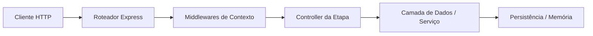

<!-- _class: lead -->

# MonitorApp — 2. API de Servidores

Endpoints de cadastro e checagem de status de servidores.

---

## Visão Geral & Objetivos

- **Escopo**: Implementar **2. API de Servidores** na aplicação evolutiva **MonitorApp**.
- **Desafio Didático**: Aplicar boas práticas de arquitetura web desacoplada.
- **Entregáveis**:
  - Código-fonte funcional em `examples/courses/express/projects/`.
  - Contratos de rotas e manipuladores de exceção alinhados à etapa.
  - Testes e validações de requisições HTTP em `requests.http`.

---

## Arquitetura & Fluxo dos Dados

- Manutenção da separação de responsabilidade em camadas.
- Handlers enxutos com repasse de erros para middlewares centralizados.

---

## Regras e Decisões de Implementação

- **Tipagem**: TypeScript com interfaces estritas para entradas e saídas.
- **Tratamento de Erros**: Erros conhecidos capturados e formatados em JSON padrão.
- **Manutenibilidade**: Código limpo, sem duplicação de regras em controllers.

---

## Execução & Testes Práticos

1. Inicie o servidor localmente com os scripts do projeto.
2. Dispare as requisições HTTP predefinidas.
3. Verifique os status codes (`200`, `201`, `400`, `401`, `404`) e os payloads.

---

## Resumo e Próximos Passos

- A etapa de **2. API de Servidores** eleva a maturidade do **MonitorApp**.
- O código resulta em um módulo pronto e testado para os próximos avanços.
