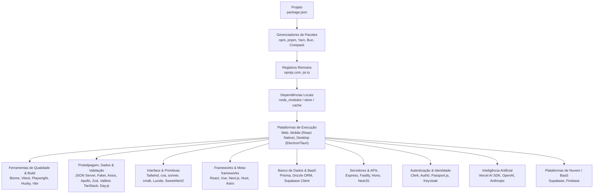

import { Aside, Card, CardGrid, Steps } from '@astrojs/starlight/components';
import Mermaid from '@components/Mermaid.astro';

O **Guia de Pacotes JavaScript** cobre o ecossistema de dependências do JavaScript e TypeScript em três camadas essenciais: os **gerenciadores e registros** (npm, pnpm, Yarn, Bun e JSR), as **ferramentas de desenvolvimento e qualidade** (Biome, Vitest, Playwright, Husky, Vite) e as **bibliotecas, frameworks e plataformas** que aceleram aplicações web, mobile e desktop (Apollo Client, Zod, Tailwind, React, Vue, Next.js, Astro, React Native, Electron e Tauri).

O recorte é deliberado: cada linguagem possui seu próprio registro e modelo de gerenciamento de dependências. Aqui o foco é o ecossistema JavaScript/TypeScript nos registros `npmjs.com` e `jsr.io` e as ferramentas que operam sobre ele. Em Python, o assunto equivalente é tratado no tópico de [uv](../python/tools/uv/), do Guia de Python.

Enquanto o [Guia de ECMAScript](../ecmascript/) cobre a sintaxe e o [Guia de Web APIs](../web-api/) trata do navegador nativo, este guia ensina a gerenciar dependências, configurar ferramentas profissionais de qualidade e integrar bibliotecas e frameworks em projetos reais.

<Aside type="tip" title="Modelo Mental">
Pacotes e bibliotecas não substituem os fundamentos da linguagem. Eles entram quando o projeto precisa de uma ferramenta de automação, uma integração padronizada ou uma camada de infraestrutura que seria cara, arriscada ou repetitiva demais para manter artesanalmente.
</Aside>

## Trilhas de Aprendizado

O guia está organizado por decisões arquiteturais e necessidades de projeto:

<CardGrid>
  <Card title="Gerenciadores e Manifesto" icon="seti:npm">
    O manifesto e gerenciamento de dependências: a anatomia do package.json e SemVer, o clássico npm, a economia de disco do pnpm, a arquitetura PnP do Yarn, a velocidade nativa do Bun e o registro moderno JSR.

    

      <a class="page-badge" href="managers/package-json/">package.json</a>
      <a class="page-badge" href="managers/npm/">npm</a>
      <a class="page-badge" href="managers/pnpm/">pnpm</a>
      <a class="page-badge" href="managers/yarn/">Yarn</a>
      <a class="page-badge" href="managers/bun/">Bun</a>
      <a class="page-badge" href="managers/jsr/">JSR</a>
      <a class="page-badge" href="managers/commands/">Comandos</a>
    

  </Card>

  <Card title="Ferramentas e Qualidade" icon="rocket">
    Automação de qualidade, testes e compilação: linter e formatador em Rust com Biome, testes unitários com Vitest, testes E2E com Playwright, automação de commits com Husky e build com Vite.

    

      <a class="page-badge" href="dev/linters/">Linters e Formatadores</a>
      <a class="page-badge" href="dev/testing/">Testes com Vitest</a>
      <a class="page-badge" href="dev/playwright/">Playwright</a>
      <a class="page-badge" href="dev/git-hooks/">Husky & Pre-commit</a>
      <a class="page-badge" href="build/vite/">Vite</a>
    

  </Card>

  <Card title="APIs, Dados e Validação" icon="seti:json">
    Prototipagem de back-end com JSON Server, geração de dados fake com Faker.js, clientes REST (Axios) e GraphQL (Apollo Client), validação com Zod e Valibot e manipulação de datas com Day.js.

    

      <a class="page-badge" href="mock/json-server/">JSON Server</a>
      <a class="page-badge" href="mock/faker/">Faker.js</a>
      <a class="page-badge" href="http/axios/">Axios</a>
      <a class="page-badge" href="http/apollo/">Apollo Client</a>
      <a class="page-badge" href="validation/zod/">Zod</a>
      <a class="page-badge" href="validation/valibot/">Valibot</a>
      <a class="page-badge" href="datetime/dayjs/">Day.js</a>
    

  </Card>

  <Card title="Interface e Feedback" icon="puzzle">
    Estilização utilitária moderna com Tailwind CSS, primitivas headless com cva/tailwind-merge/sonner/cmdk, estado e tabelas headless com a Suíte TanStack, iconografia vetorial com Lucide Icons e modais com SweetAlert2.

    

      <a class="page-badge" href="ui/tailwind/">Tailwind CSS</a>
      <a class="page-badge" href="ui/modern-ui-primitives/">Primitivas de UI</a>
      <a class="page-badge" href="ui/tanstack/">Suíte TanStack</a>
      <a class="page-badge" href="ui/lucide/">Lucide Icons</a>
      <a class="page-badge" href="ui/sweetalert2/">SweetAlert2</a>
    

  </Card>

  <Card title="Gráficos e Visualização" icon="approve-check">
    Visualização de dados e informações espaciais com gráficos em Canvas (Chart.js), SVG customizado (D3.js) e mapas (Leaflet).

    

      <a class="page-badge" href="ui/chartjs/">Chart.js</a>
      <a class="page-badge" href="ui/d3/">D3.js</a>
      <a class="page-badge" href="ui/leaflet/">Leaflet</a>
    

  </Card>

  <Card title="Frameworks e Renderização" icon="laptop">
    Bibliotecas de UI (React, Vue, Angular, Svelte) e meta-frameworks full-stack com estratégias de SSR, SSG, ISR e Ilhas (Next.js, Nuxt, Astro, Remix).

    

      <a class="page-badge" href="frameworks/ui-frameworks/">Frameworks de UI</a>
      <a class="page-badge" href="frameworks/ssr-ssg/">SSR e SSG</a>
    

  </Card>

  <Card title="Aplicações Multiplataforma" icon="seti:code-climate">
    Desenvolvimento nativo além da web: aplicativos móveis para iOS/Android com React Native & Expo e softwares desktop com Electron e Tauri.

    

      <a class="page-badge" href="platforms/react-native/">React Native e Expo</a>
      <a class="page-badge" href="platforms/desktop-apps/">Aplicações Desktop</a>
    

  </Card>

  <Card title="Banco de Dados e BaaS" icon="seti:db">
    Mapeamento objeto-relacional (ORM) com Prisma e Drizzle ORM, e persistência em nuvem com PostgreSQL gerenciado via Supabase Client.

    

      <a class="page-badge" href="database/prisma/">Prisma</a>
      <a class="page-badge" href="database/drizzle/">Drizzle ORM</a>
      <a class="page-badge" href="cloud/supabase/">Supabase Client</a>
    

  </Card>

  <Card title="Servidores, Segurança e IA" icon="setting">
    Construção de APIs e microsserviços com Express/Fastify/Hono/NestJS, controle de acesso e autenticação com Clerk/Auth0/Passport/Keycloak e integração de IA com Vercel AI SDK/OpenAI/Anthropic.

    

      <a class="page-badge" href="backend/web-frameworks/">Frameworks de Servidor</a>
      <a class="page-badge" href="auth/auth-providers/">Autenticação e Identidade</a>
      <a class="page-badge" href="ai/llm-sdks/">IA e SDKs de LLM</a>
    

  </Card>

  <Card title="Referência e Decisão" icon="information">
    Mapas de decisão para escolher pacotes, diferenciar biblioteca de serviço e planejar integrações sem inchar o projeto.

    

      <a class="page-badge" href="reference/package-map/">Mapa de Pacotes</a>
    

  </Card>
</CardGrid>

---

## Ecossistema, Pacotes e Serviços

O ecossistema JavaScript articula desenvolvedores, registros de pacotes e ferramentas de execução. Entender o papel de cada peça evita confusões frequentes entre o que é linguagem, o que é API nativa do navegador, o que é dependência instalada e o que é serviço em nuvem.

O diagrama abaixo sintetiza a relação entre essas camadas:

| Camada | O que é | Exemplos no guia | Pergunta prática |
| :--- | :--- | :--- | :--- |
| **Gerenciador de Pacotes** | Ferramenta que instala, trava versões e gerencia monorepos. | npm, pnpm, Yarn, Bun | Como reproduzir o ambiente e otimizar disco? |
| **Registro de Pacotes** | Catálogo público hospedado na internet. | npmjs.com, jsr.io | Onde os pacotes são descobertos e baixados? |
| **Ferramenta de Qualidade & Build** | Binários executados no terminal e no CI. | Biome, Vitest, Playwright, Husky, Vite | Como validar, testar e empacotar o código? |
| **Clientes de Dados & Validação** | Código importado para transporte, cache e integridade. | JSON Server, Faker, Axios, Apollo, Zod, Valibot, TanStack, Day.js | Como consumir APIs REST/GraphQL e validar dados? |
| **Interface e Primitivas** | Estilização, utilitários headless e design systems. | Tailwind, cva, tailwind-merge, sonner, cmdk, Lucide | Como criar interfaces consistentes, acessíveis e tipadas? |
| **Frameworks de UI & Meta-frameworks** | Arquiteturas de componentes e renderização (SSR/SSG). | React, Vue, Angular, Next.js, Nuxt, Astro | Como estruturar a aplicação e otimizar SEO/LCP? |
| **Plataformas Multiplataforma** | Runtimes e shells nativos para mobile e desktop. | React Native, Expo, Electron, Tauri | Como levar código web para lojas mobile e desktop? |
| **Banco de Dados & BaaS** | Modelagem declarativa e acesso tipado a bancos relacionais e nuvem. | Prisma, Drizzle ORM, Supabase Client | Como persistir dados com tipagem estrita no Node.js e nuvem? |
| **Servidores & APIs Web** | Frameworks HTTP e microsserviços rápidos e modulares. | Express, Fastify, Hono, NestJS | Qual arquitetura de servidor atende melhor à minha escala? |
| **Autenticação & Identidade** | Gestão de sessões, tokens JWT, OIDC e provedores de autenticação. | Clerk, Auth0, Passport.js, Keycloak | Como proteger endpoints e gerenciar credenciais com segurança? |
| **Inteligência Artificial & LLMs** | SDKs de modelos generativos, streaming e chamadas de funções. | Vercel AI SDK, OpenAI, Anthropic | Como integrar IA e saídas tipadas em aplicações modernas? |
| **Serviço Remoto (BaaS)** | Plataforma hospedada com banco de dados e autenticação. | Supabase e Firebase (no [Guia de Nuvem](../cloud/)) | Estou terceirizando infraestrutura e armazenamento? |

## Roteiro Sugerido de Estudos

<Steps>
1. **Manifesto, Gerenciadores e Registros**: Comece por [package.json](managers/package-json/) para dominar a anatomia do manifesto, campos e SemVer. Domine a CLI oficial do [npm](managers/npm/), a economia de disco do [pnpm](managers/pnpm/), o Plug'n'Play do [Yarn](managers/yarn/), a velocidade nativa do [Bun](managers/bun/), o suporte a TypeScript nativo do [JSR](managers/jsr/) e consulte o [Comparativo de Comandos](managers/commands/) para transitar entre eles.
2. **Qualidade e Ferramentas**: Configure o [Biome](dev/linters/) para linting e formatação instantânea em Rust, adicione testes unitários rápidos com [Vitest](dev/testing/), cubra fluxos reais de navegador com [Playwright](dev/playwright/), automatize *hooks* no Git com [Husky e Pre-commit](dev/git-hooks/) e empacote com [Vite](build/vite/).
3. **APIs, Dados e Validação**: Suba uma API simulada com [JSON Server](mock/json-server/), gere dados fake com [Faker.js](mock/faker/), integre requisições REST com [Axios](http/axios/), consuma schemas GraphQL com [Apollo Client](http/apollo/), proteja os dados recebidos com [Zod](validation/zod/) e [Valibot](validation/valibot/) e manipule datas com [Day.js](datetime/dayjs/).
4. **Interface, Componentes e Gráficos**: Estruture o design com [Tailwind CSS](ui/tailwind/), componha variantes e comandos com [Primitivas de UI](ui/modern-ui-primitives/), sincronize o estado remoto e tabelas com a [Suíte TanStack](ui/tanstack/), utilize ícones vetoriais com [Lucide Icons](ui/lucide/), adicione modais com [SweetAlert2](ui/sweetalert2/) e renderize gráficos e mapas com [Chart.js](ui/chartjs/), [D3.js](ui/d3/) e [Leaflet](ui/leaflet/).
5. **Frameworks e Estratégias de Renderização**: Compare paradigmas de componentes em [Frameworks de UI](frameworks/ui-frameworks/) (React, Vue, Angular, Svelte) e domine SSR, SSG e Ilhas em [SSR, SSG e Meta-frameworks](frameworks/ssr-ssg/) (Next.js, Nuxt, Astro, Remix).
6. **Aplicações Multiplataforma**: Construa aplicativos móveis nativos para iOS/Android com [React Native e Expo](platforms/react-native/) e desenvolva softwares desktop instaláveis para Windows, macOS e Linux com [Electron e Tauri](platforms/desktop-apps/).
7. **Banco de Dados e BaaS**: Modele esquemas com [Prisma](database/prisma/) e [Drizzle ORM](database/drizzle/), e integre banco PostgreSQL gerenciado com autenticação via [Supabase Client](cloud/supabase/).
8. **Servidores e APIs de Servidor**: Compare paradigmas HTTP para construir back-ends rápidos e tipados com [Frameworks de Servidor](backend/web-frameworks/) (Express, Fastify, Hono e NestJS).
9. **Autenticação e Identidade**: Proteja rotas e gerencie sessões, tokens JWT e federação corporativa em [Autenticação e Identidade](auth/auth-providers/) (Clerk, Auth0, Passport.js e Keycloak).
10. **Inteligência Artificial**: Integre modelos de linguagem de grande porte, streaming de texto e chamadas de ferramentas com [IA e SDKs de LLM](ai/llm-sdks/).
11. **Decisões Arquiteturais**: Consulte o [Mapa de Pacotes](reference/package-map/) para auditar riscos de segurança, impacto no bundle size e alternativas nativas antes de instalar novos pacotes.
</Steps>

---

## Referências

- [npm | Node Package Manager](https://www.npmjs.com/)
- [pnpm | Fast, disk space efficient package manager](https://pnpm.io/)
- [Yarn | Modern Package Manager](https://yarnpkg.com/)
- [Bun | Incredibly fast JavaScript runtime and package manager](https://bun.sh/)
- [JSR | The JavaScript Registry](https://jsr.io/)
- [Biome | Toolchain of the web](https://biomejs.dev/)
- [Vitest | Next Generation Testing Framework](https://vitest.dev/)
- [Playwright | Fast and reliable end-to-end testing](https://playwright.dev/)
- [Husky Documentation](https://typicode.github.io/husky/)
- [Vite Documentation](https://vitejs.dev/)
- [JSON Server](https://github.com/typicode/json-server)
- [Faker.js Documentation](https://fakerjs.dev/)
- [Axios Documentation](https://axios-http.com/)
- [Apollo Client Documentation](https://www.apollographql.com/docs/react/)
- [Zod Documentation](https://zod.dev/)
- [Valibot Documentation](https://valibot.dev/)
- [TanStack Documentation](https://tanstack.com/)
- [Day.js Documentation](https://day.js.org/)
- [Tailwind CSS Documentation](https://tailwindcss.com/)
- [Class Variance Authority (cva)](https://cva.style/docs)
- [Sonner Documentation](https://sonner.emilkowal.ski/)
- [cmdk GitHub Repository](https://cmdk.paco.me/)
- [Lucide Icons](https://lucide.dev/)
- [SweetAlert2 Documentation](https://sweetalert2.github.io/)
- [Chart.js Documentation](https://www.chartjs.org/)
- [D3.js Documentation](https://d3js.org/)
- [Leaflet Documentation](https://leafletjs.com/)
- [React Documentation](https://react.dev/)
- [Vue.js Documentation](https://vuejs.org/)
- [Angular Documentation](https://angular.dev/)
- [Next.js Documentation](https://nextjs.org/)
- [Astro Documentation](https://docs.astro.build/)
- [React Native Documentation](https://reactnative.dev/)
- [Expo Documentation](https://docs.expo.dev/)
- [Electron Documentation](https://www.electronjs.org/)
- [Tauri Documentation](https://v2.tauri.app/)
- [Prisma Documentation](https://www.prisma.io/docs)
- [Drizzle ORM Documentation](https://orm.drizzle.team/)
- [Supabase JavaScript Client](https://supabase.com/docs/reference/javascript/introduction)
- [Express Documentation](https://expressjs.com/)
- [Fastify Documentation](https://fastify.dev/)
- [Hono Documentation](https://hono.dev/)
- [NestJS Documentation](https://nestjs.com/)
- [Clerk Documentation](https://clerk.com/docs)
- [Auth0 Documentation](https://auth0.com/docs)
- [Passport.js Documentation](https://www.passportjs.org/)
- [Keycloak Documentation](https://www.keycloak.org/documentation)
- [Vercel AI SDK Documentation](https://sdk.vercel.ai/docs)
- [OpenAI Node.js SDK](https://github.com/openai/openai-node)
- [Anthropic TypeScript SDK](https://github.com/anthropics/anthropic-sdk-typescript)
