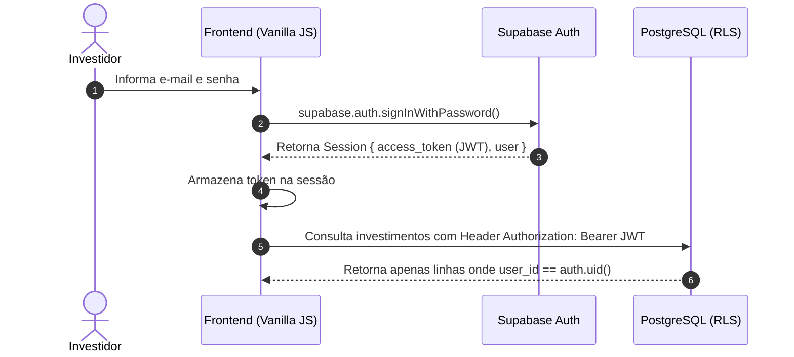

import { Aside } from '@astrojs/starlight/components';

A segurança e o isolamento de contas no InvestBaaS são gerenciados pelo **Supabase Auth**, eliminando a necessidade de construir um microsserviço de autenticação dedicado.

O Supabase Auth gerencia o ciclo de vida dos usuários, emite JSON Web Tokens (JWT) assinados e propaga a identidade do investidor para o banco de dados PostgreSQL.

## Objetivo

Compreender o funcionamento do Supabase Auth no InvestBaaS, implementando cadastro de usuários, login seguro com e-mail/senha e proteção de páginas no cliente.

## Fluxo de Autenticação

O fluxo de autenticação baseia-se em tokens JWT armazenados com segurança no navegador do cliente.

O diagrama a seguir descreve a troca de credenciais entre o cliente e o serviço Supabase Auth:



O token JWT é automaticamente enviado em todas as requisições subsequentes ao banco de dados e aos buckets de armazenamento.

## Inicializando o Cliente Supabase

Para interagir com o serviço BaaS a partir do frontend Vanilla JS, inicializa-se o cliente oficial com as credenciais públicas do projeto.

O exemplo de código a seguir demonstra a configuração do cliente Supabase:

```javascript
import { createClient } from '@supabase/supabase-js';

const SUPABASE_URL = 'https://seu-projeto.supabase.co';
const SUPABASE_ANON_KEY = 'sua-chave-anonima-publica';

export const supabase = createClient(SUPABASE_URL, SUPABASE_ANON_KEY);
```

## Cadastro e Login de Usuários

O registro de novos investidores e a autenticação ocorrem através de métodos declarativos do SDK.

O trecho a seguir ilustra a implementação das funções de cadastro e login:

```javascript
// Cadastro de novo usuário
export async function registerUser(email, password, fullName) {
  const { data, error } = await supabase.auth.signUp({
    email,
    password,
    options: {
      data: { full_name: fullName }
    }
  });
  if (error) throw error;
  return data;
}

// Login de usuário existente
export async function loginUser(email, password) {
  const { data, error } = await supabase.auth.signInWithPassword({
    email,
    password
  });
  if (error) throw error;
  return data;
}
```

## Proteção de Rotas no Frontend

Para evitar que usuários não autenticados acessem a carteira, uma verificação de sessão é executada no carregamento das páginas protegidas.

O trecho a seguir demonstra a validação de sessão ativa:

```javascript
export async function requireAuth() {
  const { data: { session } } = await supabase.auth.getSession();
  if (!session) {
    window.location.href = './signin.html';
    return null;
  }
  return session.user;
}
```

Caso o usuário não possua uma sessão válida, o navegador é redirecionado para a página de login.

## Executando

Para testar as telas de login e cadastro na etapa atual do projeto, abra as páginas `signin.html` e `signup.html` no navegador.

Execute o comando a seguir:

```bash
pnpm dev
```

## Exercício

Descreva como o Supabase Auth injeta a identidade do usuário nas requisições HTTP para que o PostgreSQL possa aplicar regras de segurança.

## Desafio

Crie uma função para realizar o logout do usuário através do método `supabase.auth.signOut()` e redirecioná-lo para a landing page.

## Perguntas de revisão

1. O que é um JWT e qual sua finalidade na autenticação BaaS?
2. Por que a chave anônima (`anon key`) do Supabase pode ser exposta no código frontend?
3. Como o método `getSession()` recupera a sessão do usuário após o recarregamento da página?

## Referências

- Supabase Auth Documentation: [https://supabase.com/docs/guides/auth](https://supabase.com/docs/guides/auth)

## Próximo tópico

Avance para [Banco de Dados & RLS](../database/) para modelar as tabelas do InvestBaaS e implementar políticas de segurança no PostgreSQL.
