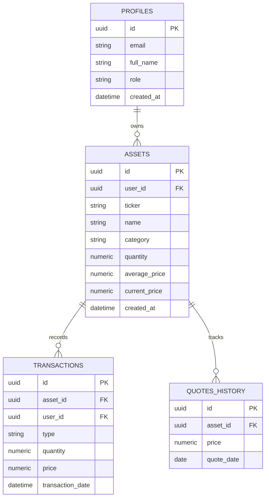

import { Aside } from '@astrojs/starlight/components';

O InvestBaaS utiliza o **PostgreSQL** hospedado no Supabase para armazenar ativos, transações, cotações diárias e rentabilidades consolidadas.

A segurança dos dados é garantida pelo recurso nativo de **Row Level Security (RLS)**, garantindo que cada investidor tenha acesso estritamente aos seus próprios registros no nível do banco de dados.

## Objetivo

Modelar as tabelas relacionais do InvestBaaS no PostgreSQL, criar chaves estrangeiras e aplicar políticas de segurança RLS para isolamento de dados multitenant.

## Modelagem Relacional

O esquema de dados divide-se em tabelas de ativos, transações de compra/venda e histórico diário de cotações.

O diagrama a seguir apresenta o modelo entidade-relacionamento do InvestBaaS:



## Criação das Tabelas em SQL

A estrutura do banco de dados é definida através de comandos DDL no PostgreSQL.

O script SQL a seguir ilustra a criação das tabelas principais da aplicação:

```sql
-- Tabela de Ativos da Carteira
CREATE TABLE assets (
  id UUID PRIMARY KEY DEFAULT gen_random_uuid(),
  user_id UUID REFERENCES auth.users(id) ON DELETE CASCADE NOT NULL,
  ticker VARCHAR(20) NOT NULL,
  name VARCHAR(100) NOT NULL,
  category VARCHAR(30) NOT NULL CHECK (category IN ('RENDA_FIXA', 'ACOES', 'FIIS', 'FUNDOS', 'CRIPTO')),
  quantity NUMERIC(15, 6) NOT NULL DEFAULT 0,
  average_price NUMERIC(15, 2) NOT NULL DEFAULT 0,
  current_price NUMERIC(15, 2) NOT NULL DEFAULT 0,
  created_at TIMESTAMPTZ DEFAULT now()
);

-- Tabela de Transações (Aportes e Resgates)
CREATE TABLE transactions (
  id UUID PRIMARY KEY DEFAULT gen_random_uuid(),
  user_id UUID REFERENCES auth.users(id) ON DELETE CASCADE NOT NULL,
  asset_id UUID REFERENCES assets(id) ON DELETE CASCADE NOT NULL,
  type VARCHAR(10) NOT NULL CHECK (type IN ('BUY', 'SELL')),
  quantity NUMERIC(15, 6) NOT NULL,
  price NUMERIC(15, 2) NOT NULL,
  receipt_url TEXT,
  transaction_date DATE NOT NULL DEFAULT CURRENT_DATE,
  created_at TIMESTAMPTZ DEFAULT now()
);
```

## Políticas de Segurança (Row Level Security)

O Row Level Security garante que cláusulas `WHERE user_id = auth.uid()` sejam aplicadas implicitamente pelo motor do banco em qualquer operação SQL.

O script a seguir habilita o RLS e estabelece as políticas de acesso:

```sql
-- Habilitar RLS nas tabelas
ALTER TABLE assets ENABLE ROW LEVEL SECURITY;
ALTER TABLE transactions ENABLE ROW LEVEL SECURITY;

-- Política de leitura: usuário só lê seus próprios ativos
CREATE POLICY "Users can view own assets"
ON assets FOR SELECT
USING (auth.uid() = user_id);

-- Política de inserção: usuário só cria ativos associados ao seu ID
CREATE POLICY "Users can insert own assets"
ON assets FOR INSERT
WITH CHECK (auth.uid() = user_id);

-- Política de atualização: usuário só edita seus próprios ativos
CREATE POLICY "Users can update own assets"
ON assets FOR UPDATE
USING (auth.uid() = user_id);

-- Política de exclusão: usuário só remove seus próprios ativos
CREATE POLICY "Users can delete own assets"
ON assets FOR DELETE
USING (auth.uid() = user_id);
```

Com essas políticas ativas, mesmo que uma consulta frontend execute `supabase.from('assets').select('*')`, o PostgreSQL retornará unicamente os ativos pertencentes ao investidor autenticado.

## Executando

Para testar consultas protegidas em um projeto Supabase, você pode executar scripts SQL no SQL Editor do painel administrativo do Supabase.

## Exercício

Escreva uma política RLS para a tabela `transactions` que permita apenas aos usuários lerem suas próprias transações.

## Desafio

Crie uma trigger no PostgreSQL que atualize automaticamente o `quantity` e o `average_price` da tabela `assets` sempre que uma nova linha for inserida na tabela `transactions`.

## Perguntas de revisão

1. Por que o RLS oferece maior confiabilidade de segurança em arquiteturas BaaS do que filtros manuais no backend?
2. O que a função `auth.uid()` do Supabase retorna no contexto de uma requisição autenticada?
3. Quais são as restrições da cláusula `CHECK` na coluna `category` da tabela `assets`?

## Referências

- Supabase Row Level Security: [https://supabase.com/docs/guides/database/postgres/row-level-security](https://supabase.com/docs/guides/database/postgres/row-level-security)

## Próximo tópico

Avance para [Cotações com Edge Functions](../edge-quotes/) para automatizar o resgate de preços de ativos da B3 com Deno.
