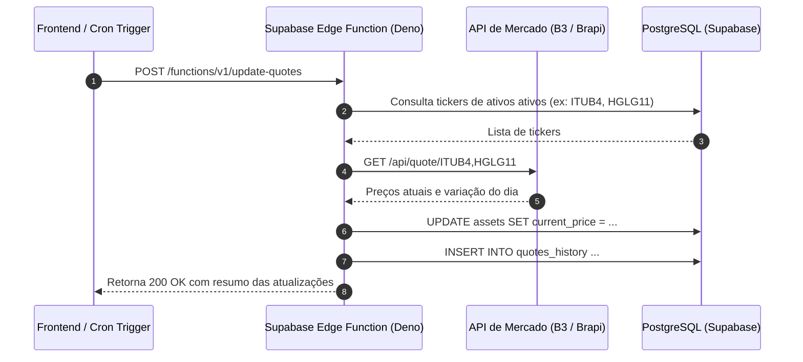

import { Aside } from '@astrojs/starlight/components';

As **Supabase Edge Functions** permitem executar código TypeScript/JavaScript no ambiente **Deno** em servidores distribuídos globalmente com baixíssima latência.

No InvestBaaS, as Edge Functions são utilizadas para buscar cotações em tempo real de ativos negociados na B3 (Ações e FIIs), calcular variações diárias e atualizar o histórico de preços dos ativos cadastrados.

## Objetivo

Compreender o papel das Edge Functions na arquitetura do InvestBaaS, desenvolvendo funções serverless para consulta de APIs de mercado e atualização programada de cotações.

## Arquitetura Serverless de Cotações

O fluxo de atualização de cotações pode ser acionado por requisição direta do usuário ou por agendamento cron no Supabase.

O diagrama a seguir descreve o fluxo de coleta e gravação das cotações:



## Estrutura de uma Edge Function em Deno

As Edge Functions no Supabase são escritas em TypeScript moderno sem necessidade de etapas de compilação manuais.

O exemplo a seguir apresenta o código da função `update-quotes`:

```typescript
import { serve } from 'https://deno.land/std@0.177.0/http/server.ts';
import { createClient } from 'https://esm.sh/@supabase/supabase-js@2';

serve(async (req) => {
  try {
    const supabaseUrl = Deno.env.get('SUPABASE_URL')!;
    const supabaseServiceKey = Deno.env.get('SUPABASE_SERVICE_ROLE_KEY')!;
    const supabase = createClient(supabaseUrl, supabaseServiceKey);

    // Buscar tickers cadastrados na carteira
    const { data: assets, error: fetchError } = await supabase
      .from('assets')
      .select('ticker')
      .in('category', ['ACOES', 'FIIS']);

    if (fetchError) throw fetchError;

    const tickers = [...new Set(assets.map(a => a.ticker))];

    // Simulação de consulta a API de cotações da B3
    const quotes = await fetchMarketQuotes(tickers);

    // Atualização em lote dos preços atuais
    for (const quote of quotes) {
      await supabase
        .from('assets')
        .update({ current_price: quote.price })
        .eq('ticker', quote.ticker);
    }

    return new Response(JSON.stringify({ updated: quotes.length, quotes }), {
      headers: { 'Content-Type': 'application/json' },
      status: 200,
    });
  } catch (err) {
    return new Response(JSON.stringify({ error: err.message }), {
      headers: { 'Content-Type': 'application/json' },
      status: 500,
    });
  }
});

async function fetchMarketQuotes(tickers: string[]) {
  // Chamada simulada de cotação de mercado
  return tickers.map(ticker => ({
    ticker,
    price: +(Math.random() * 50 + 20).toFixed(2),
    timestamp: new Date().toISOString()
  }));
}
```

## Disparo a partir do Frontend

O investidor pode forçar a atualização imediata das cotações da sua carteira clicando no botão "Atualizar Cotações" no dashboard.

O trecho a seguir demonstra a invocação da Edge Function via SDK:

```javascript
export async function triggerQuoteUpdate() {
  const { data, error } = await supabase.functions.invoke('update-quotes', {
    body: { refresh: true }
  });
  if (error) {
    console.error('Erro ao atualizar cotações:', error);
    return false;
  }
  return data;
}
```

## Executando

Para testar localmente Edge Functions do Supabase, utiliza-se o Supabase CLI com o comando `supabase functions serve`.

## Exercício

Explique por que a Edge Function utiliza a `SUPABASE_SERVICE_ROLE_KEY` em vez da chave anônima para executar rotinas de atualização em lote.

## Desafio

Adicione tratamento de erros na função para que uma falha na consulta de um ticker individual não interrompa a atualização dos demais ativos.

## Perguntas de revisão

1. Quais são as principais diferenças entre executar código no Deno versus Node.js em Edge Functions?
2. Como funciona a proteção de rotas e o envio de headers de autorização para Edge Functions?
3. O que são variáveis de ambiente em Edge Functions e como acessá-las com segurança?

## Referências

- Supabase Edge Functions: [https://supabase.com/docs/guides/functions](https://supabase.com/docs/guides/functions)

## Próximo tópico

Avance para [Armazenamento de Comprovantes](../storage/) para gerenciar notas de corretagem e recibos no Supabase Storage.
