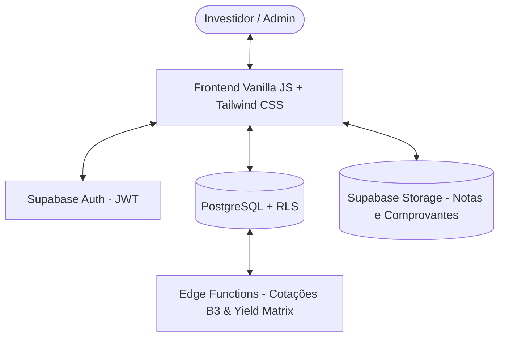

import { Aside, Card, CardGrid } from '@astrojs/starlight/components';
import FileTree from '@components/FileTree.astro';
import ProjectLinks from '@components/ProjectLinks.astro';

<ProjectLinks path="examples/courses/npm/projects/investbaas-static" />

O **InvestBaaS** é uma aplicação completa de gestão patrimonial e análise de investimentos desenvolvida sob o paradigma de **Backend as a Service (BaaS)** com Supabase e frontend em Vanilla JavaScript com Tailwind CSS.

A plataforma permite consolidar ativos de diferentes classes (Renda Fixa, Ações B3, FIIs, Fundos de Investimento e Criptoativos), calcular a rentabilidade histórica em matrizes anuais e mensais (em R$ e %), efetuar cotações automatizadas via Edge Functions e isolar rigorosamente os registros por investidor com Row Level Security (RLS).

## Objetivo

Apresentar a arquitetura, o fluxo de dados, a modelagem de domínio e o roteiro de desenvolvimento em etapas do InvestBaaS, capacitando o desenvolvedor a construir aplicações financeiras seguras e escaláveis com Supabase.

## Arquitetura da Aplicação

A arquitetura do InvestBaaS é dividida em uma camada de apresentação desacoplada e serviços gerenciados em nuvem via BaaS.

O diagrama a seguir sintetiza a interação entre os componentes do ecossistema:



A divisão de responsabilidades garante que regras de negócio críticas e políticas de acesso residam diretamente na camada de dados e em funções serveless isoladas.

## Etapas do Projeto

O desenvolvimento do InvestBaaS é organizado em etapas cumulativas e incrementais:

1. **[Backlog do Projeto](backlog/)**: Planejamento de épicos, histórias de usuário, critérios de aceite e sprints.
2. **[Frontend Estático](front-static/)**: Construção das telas da aplicação com Tailwind CSS e simulador de juros compostos.
3. **[Autenticação BaaS](auth/)**: Gestão de identidade com Supabase Auth, tokens JWT e proteção de rotas.
4. **[Banco de Dados & RLS](database/)**: Modelagem relacional no PostgreSQL, migrações e políticas de segurança por usuário.
5. **[Cotações com Edge Functions](edge-quotes/)**: Integração com APIs financeiras e rotinas serverless em Deno.
6. **[Armazenamento de Comprovantes](storage/)**: Upload de notas de corretagem e documentos no Supabase Storage.
7. **[Analytics & Painel Admin](analytics/)**: Matriz de rentabilidade anual/mensal e consolidação de AUM para administradores.
8. **[Próximos Passos](next-steps/)**: Evolução da arquitetura em 8 pilares estruturais.

## Estrutura de Diretórios

A estrutura da etapa inicial estática do projeto organiza a documentação ágil, folhas de estilo e páginas HTML da seguinte forma:

<FileTree>
- examples/courses/npm/projects/investbaas-static/
  - .agents/
    - skills/
      - task-pr-finalizer/
      - task-spec-generator/
  - .github/
    - pull_request_template.md
  - css/
    - components.css
  - docs/
    - PRD.md
    - SPRINTS.md
  - specs/
    - archived/
  - admin.html
  - analytics.html
  - dashboard.html
  - index.html
  - package.json
  - README.md
  - signin.html
  - signup.html
</FileTree>

Cada arquivo HTML representa uma visão especializada da jornada do usuário na plataforma.

## Executando o Projeto

Para executar o projeto estático localmente, basta utilizar o script de inicialização via servidor HTTP simples do ecossistema Node.js.

Execute os comandos a seguir no terminal:

```bash
cd examples/courses/npm/projects/investbaas-static
pnpm install
pnpm dev
```

Após o comando, acesse o endereço indicado no navegador para navegar pela landing page, simulador, carteira e matriz de rendimentos.

## Exercício

Analise a estrutura de diretórios do InvestBaaS e identifique onde as especificações técnicas de cada tarefa são armazenadas no fluxo com agentes de inteligência artificial.

## Desafio

Execute o projeto localmente e teste o simulador de juros compostos na landing page com diferentes valores de aporte mensal e prazos em anos.

## Perguntas de revisão

1. Quais são as principais vantagens de adotar uma arquitetura BaaS com Supabase para aplicações financeiras?
2. Como o Row Level Security (RLS) protege os dados dos investidores no PostgreSQL?
3. Qual o papel das Edge Functions na atualização de cotações da B3?

## Referências

- Documentação Oficial do Supabase: [https://supabase.com/docs](https://supabase.com/docs)
- Documentação do Tailwind CSS: [https://tailwindcss.com/docs](https://tailwindcss.com/docs)

## Próximo tópico

Avance para o [Backlog do Projeto](backlog/) para entender o planejamento ágil, histórias de usuário e estimativas do InvestBaaS.
