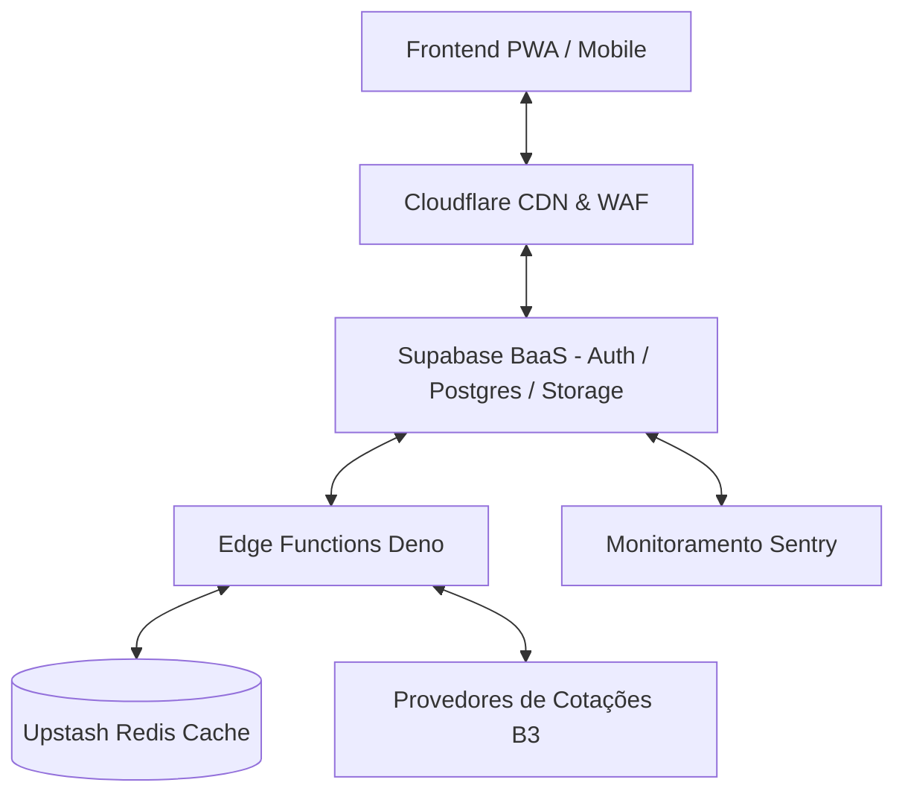

import { Aside } from '@astrojs/starlight/components';

A conclusão do protótipo estático e o planejamento das etapas BaaS estabelecem as bases para a evolução contínua do **InvestBaaS**.

Para transformar a plataforma em uma solução corporativa de alta disponibilidade e segurança regulatória, o roadmap técnico é estruturado em **8 pilares arquiteturais**.

## Objetivo

Compreender as oportunidades de melhoria contínua e as práticas avançadas para escalabilidade, observabilidade e segurança do InvestBaaS.

## Dicas de IA

Ao solicitar assistência de inteligência artificial para planejar novas funcionalidades ou refatorar o código da aplicação, utilize um prompt estruturado que contextualize as decisões arquiteturais da plataforma.

### Prompt de Evolução do Projeto

Utilize o prompt a seguir para planejar a implementação dos próximos passos:

```text
Atue como arquiteto de software especialista em Supabase e engenharia financeira. Analise o projeto InvestBaaS e proponha um plano detalhado de implementação para um dos 8 pilares estruturais (Observabilidade, Testes E2E, Resiliência, etc.), incluindo schemas SQL, políticas RLS e contratos de Edge Functions.
```

## Os 8 Pilares de Evolução Arquitetural

A tabela a seguir resume as frentes de evolução técnica planejadas para o InvestBaaS:

| Pilar | Área de Foco | Melhorias Planejadas |
| :--- | :--- | :--- |
| **1. Segurança & Hardening** | Políticas de Acesso | Autenticação multifator (MFA/TOTP), rotação de chaves e auditoria estrita de RLS. |
| **2. Integração com B3 & APIs** | Provedores Financeiros | Webhooks em tempo real com a B3 e APIs de cotações com fallback automático. |
| **3. Rebalanceamento de Carteira** | Algoritmos Financeiros | Sugestão inteligente de novos aportes para atingir a meta ideal por classe de ativo. |
| **4. Cálculos Tributários** | Fiscal & Imposto de Renda | Apuração automática de DARF sobre ganho de capital em ações e isenções de R$ 20 mil. |
| **5. Observabilidade & Logs** | Monitoramento | Integração com Sentry para rastreamento de erros e dashboards de telemetria no Supabase. |
| **6. Testes Automatizados** | Qualidade de Software | Suíte de testes ponta a ponta (E2E) com Playwright e testes unitários de Edge Functions. |
| **7. CI/CD & Deploy Contínuo** | Automação de Entregas | Pipelines no GitHub Actions para migrações automatizadas de banco e deploy serverless. |
| **8. Performance & Caching** | Otimização | Cache de cotações em Redis/Upstash e otimização de índices no PostgreSQL. |

## Diagrama da Arquitetura Alvo

A arquitetura corporativa expandida contempla serviços de mensageria, cache em memória e integrações fiscais:



## Exercício

Selecione um dos 8 pilares arquiteturais e descreva como sua implementação impacta a confiabilidade do sistema financeiro.

## Desafio

Desenhe um fluxo detalhado para o pilar de **Rebalanceamento de Carteira**, demonstrando como o sistema calcula o valor de aporte necessário para reequilibrar as classes de ativos do investidor.

## Perguntas de revisão

1. Por que o rebalanceamento automático de carteira agrega valor à experiência do investidor?
2. Como a integração com um cache Redis alivia a carga sobre o banco de dados e APIs externas de cotação?
3. Quais são as principais regulamentações fiscais que impactam o cálculo de ganho de capital na B3?

## Referências

- Supabase Production Checklist: [https://supabase.com/docs/guides/platform/going-into-prod](https://supabase.com/docs/guides/platform/going-into-prod)
- Melhores Práticas de Arquitetura Financeira: [https://www.anbima.com.br](https://www.anbima.com.br)

## Próximo tópico

Retorne ao [Guia de Pacotes JavaScript](../../../) para explorar outros tópicos e ecossistemas de desenvolvimento.
