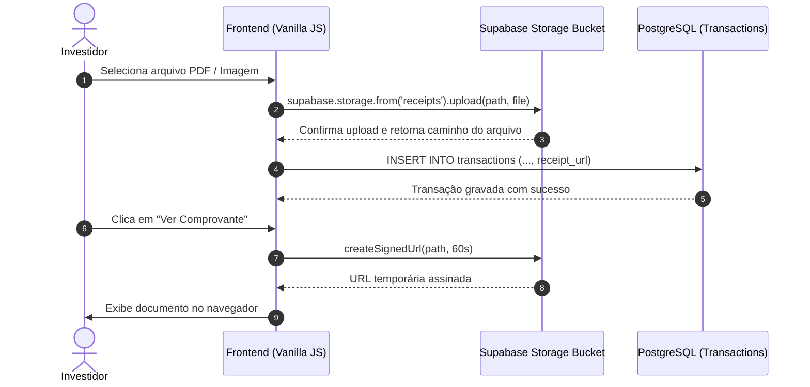

import { Aside } from '@astrojs/starlight/components';

No InvestBaaS, os investidores podem anexar notas de corretagem, comprovantes de aportes em PDF e imagens de recibos diretamente em suas transações financeiras.

Esses arquivos são armazenados de forma segura em **Buckets do Supabase Storage**, com controle de acesso integrado ao sistema de autenticação e proteção por políticas RLS.

## Objetivo

Implementar o upload de arquivos e notas de corretagem no Supabase Storage, associando URLs seguras aos registros de transações no banco de dados.

## Arquitetura do Armazenamento

Os arquivos de comprovantes residem em um bucket privado chamado `receipts`.

O diagrama a seguir descreve o fluxo de upload e visualização de comprovantes:



## Criação e Políticas do Bucket

Para garantir a privacidade financeira, o bucket de comprovantes deve ser configurado como privado, permitindo leitura e escrita apenas pelo proprietário do documento.

O script SQL a seguir configura o bucket e suas políticas de acesso:

```sql
-- Inserir bucket privado de recibos
INSERT INTO storage.buckets (id, name, public)
VALUES ('receipts', 'receipts', false);

-- Permitir upload apenas na pasta com o ID do usuário (auth.uid()/*)
CREATE POLICY "Users can upload own receipts"
ON storage.objects FOR INSERT
TO authenticated
WITH CHECK (
  bucket_id = 'receipts' AND
  (storage.foldername(name))[1] = auth.uid()::text
);

-- Permitir visualização apenas dos arquivos da própria pasta
CREATE POLICY "Users can view own receipts"
ON storage.objects FOR SELECT
TO authenticated
USING (
  bucket_id = 'receipts' AND
  (storage.foldername(name))[1] = auth.uid()::text
);
```

## Implementação do Upload no Frontend

A captura do arquivo via input HTML e o envio para o Supabase Storage são implementados de forma declarativa.

O trecho de código a seguir demonstra o processo de upload e geração de URL assinada:

```javascript
export async function uploadReceipt(userId, file) {
  const fileExt = file.name.split('.').pop();
  const fileName = `${Date.now()}.${fileExt}`;
  const filePath = `${userId}/${fileName}`;

  const { data, error } = await supabase.storage
    .from('receipts')
    .upload(filePath, file, {
      cacheControl: '3600',
      upsert: false
    });

  if (error) throw error;
  return filePath;
}

export async function getReceiptUrl(filePath) {
  const { data, error } = await supabase.storage
    .from('receipts')
    .createSignedUrl(filePath, 60); // Válido por 60 segundos

  if (error) throw error;
  return data.signedUrl;
}
```

## Executando

Para experimentar a estrutura visual dos cartões e formulários do projeto, execute o servidor local.

Execute o comando a seguir:

```bash
pnpm dev
```

## Exercício

Por que é recomendado organizar os arquivos no Storage utilizando o identificador `user_id` como primeiro segmento do caminho da pasta?

## Desafio

Implemente uma validação client-side que limite o tamanho máximo do arquivo de upload a 5MB e restrinja as extensões permitidas para `.pdf`, `.png` e `.jpg`.

## Perguntas de revisão

1. Qual a diferença entre um bucket público e um bucket privado no Supabase Storage?
2. Como uma URL assinada (*signed URL*) garante acesso temporário e seguro a documentos confidenciais?
3. O que acontece quando um usuário tenta ler um arquivo localizado na pasta de outro usuário em um bucket privado?

## Referências

- Supabase Storage Documentation: [https://supabase.com/docs/guides/storage](https://supabase.com/docs/guides/storage)

## Próximo tópico

Avance para [Analytics & Painel Admin](../analytics/) para explorar a construção da matriz de rentabilidade mensal e as métricas administrativas.
